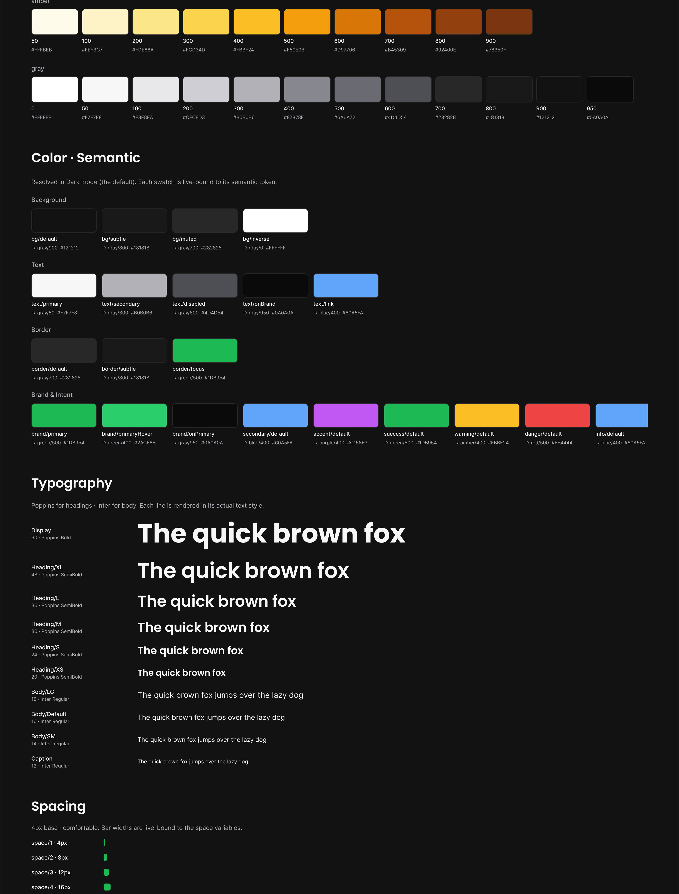
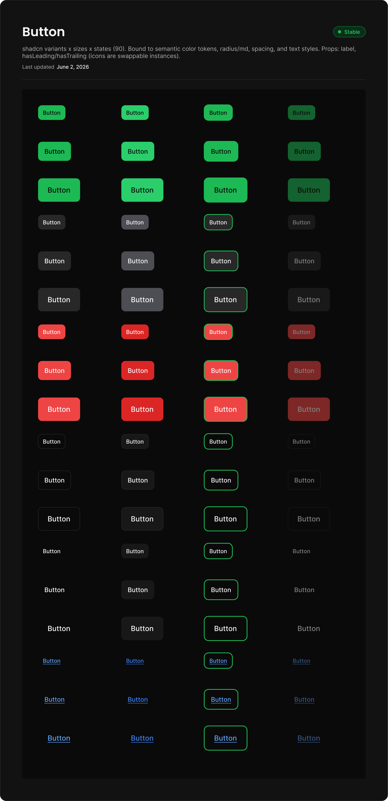
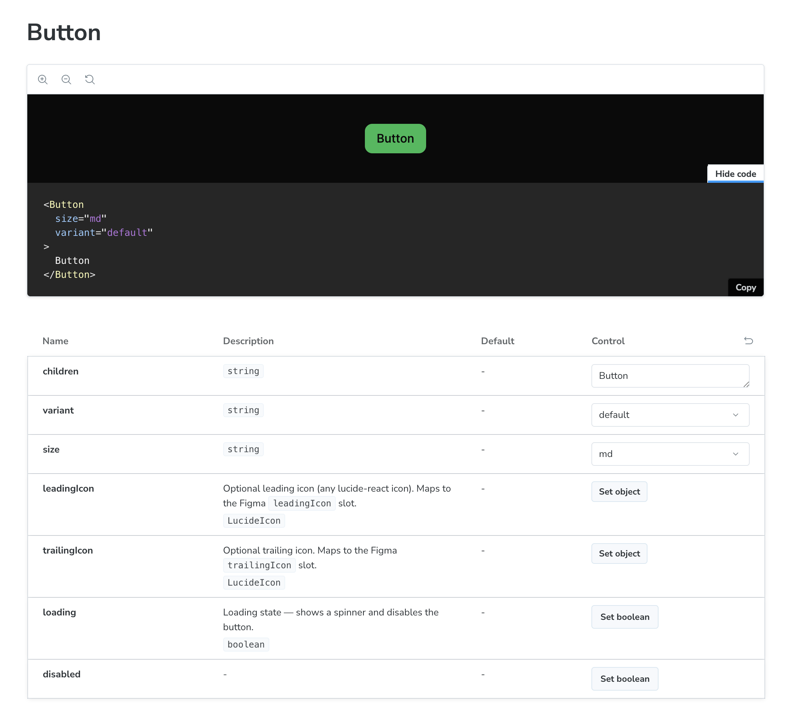

# From Figma to Code — A Complete Design System

[](https://main--6a1ee089ae3a37b70a6e4559.chromatic.com)
[](https://www.figma.com/design/OCiZiGpsJ4ncPD8r205BjC/Throughline-Plugin-Test?node-id=0-1&t=5ERihD6fMqMuTEXD-1)
[](https://github.com/jrpease/throughline)
[](LICENSE)

This repo is a complete, production-grade design system — built from scratch using the **[Throughline](https://github.com/jrpease/throughline)** Claude Code plugin. Every token, icon, and component was authored in Figma first, then synced to code automatically. No manual copying. No drift between design and implementation.

**Figma is the source of truth. Code is generated from it.**

```
Figma variables → Style Dictionary → Tailwind tokens → React components → Storybook + Chromatic
```

---

## Built with Throughline

This entire system was produced with the **[Throughline](https://github.com/jrpease/throughline)** Claude Code plugin — a set of skills that guide you from a blank Figma file to a synced, story-tested component library, step by step.

```bash
claude plugin marketplace add jrpease/throughline
claude plugin install throughline@throughline-marketplace
```

Then just say **"let's set up my design system"** and the plugin takes it from there. **Built for designers and developers** — Throughline scales its explanations to your comfort level.

→ **[github.com/jrpease/throughline](https://github.com/jrpease/throughline)**

---

## See it live

| | |
|---|---|
| 🎨 **[Figma File](https://www.figma.com/design/OCiZiGpsJ4ncPD8r205BjC/Throughline-Plugin-Test?node-id=0-1&t=5ERihD6fMqMuTEXD-1)** | Tokens, components, and foundations — the design source of truth |
| 📚 **[Live Storybook](https://main--6a1ee089ae3a37b70a6e4559.chromatic.com)** | 14 components, all props, auto-generated docs |
| 🔌 **[Get the Plugin](https://github.com/jrpease/throughline)** | Build your own design system the same way |

---

## The design foundation

Every value in the system — colors, spacing, type, radius, elevation — lives as a Figma variable. The **Foundations** page is generated directly from those variables, live-bound so it always reflects the current state of the system.



**Two-tier token system:**
- **Primitives** — raw values: full color ramps (green, blue, purple, red, amber, gray), a complete type scale (Display → Caption), spacing (space/1 – space/24), radius, and elevation.
- **Semantic** — meaningful aliases that point at primitives (`bg/default → gray/900`, `brand/primary → green/500`). Light and dark modes both supported. Change a primitive and it cascades to every component that uses it.

---

## Components

14 production-ready components built in Figma as variant matrices, then implemented in React consuming the synced tokens.



Each component artboard in Figma documents every variant (type × size × state) in a single frame, labeled "Stable" once it passes review. The Button above shows 90 variants — `default / secondary / destructive / outline / ghost / link` across 3 sizes and 5 states.

**Full component list:**

| | | | |
|---|---|---|---|
| Avatar | Badge | Button | Card |
| Checkbox | Input | Radio | Select |
| Select Menu | Spinner | Switch | Textarea |
| Tooltip | Icons | | |

All components are:
- Bound to semantic tokens (no hardcoded values)
- Built with `cva` + `VariantProps` for type-safe variant APIs
- Documented in Storybook with live controls and auto-generated prop tables
- Visually regression-tested on every push via Chromatic

**In Storybook, every component ships with a full props panel and auto-generated docs:**



**[Browse the live Storybook →](https://main--6a1ee089ae3a37b70a6e4559.chromatic.com)**

---

## In code

The repo is a pnpm + Turborepo monorepo with two packages:

```
throughline-sample/
├── packages/
│   ├── tokens/          # Figma variables → DTCG JSON → Style Dictionary build
│   │   ├── dtcg/        # Token source files (generated from Figma)
│   │   └── build/       # CSS custom properties, Tailwind theme config
│   └── ui/              # React component library
│       └── src/
│           ├── components/   # One folder per component (Component.tsx + Component.stories.tsx)
│           └── styles/       # Global CSS (imports token vars)
└── apps/                # Empty — ready for a consumer app
```

**Token pipeline:** Figma variables → DTCG JSON → Style Dictionary → CSS custom properties (`--color-brand-primary`) + a Tailwind theme extension. One command re-runs the whole pipeline and opens a PR.

**CI:** Every push runs Chromatic with full snapshots (TurboSnap intentionally off — token changes are global and must always snapshot everything).

```bash
# Run it yourself
pnpm install
cd packages/ui && pnpm storybook   # dev server at :6006
```

---

## Want to build your own?

Everything in this repo — the token system, the component library, the Storybook setup, the CI pipeline — was generated by the Throughline plugin in a single session. Install it and say **"let's set up my design system."**

→ **[github.com/jrpease/throughline](https://github.com/jrpease/throughline)**

---

<sub>Built by [Jordan Pease](https://github.com/jrpease) · MIT License</sub>
